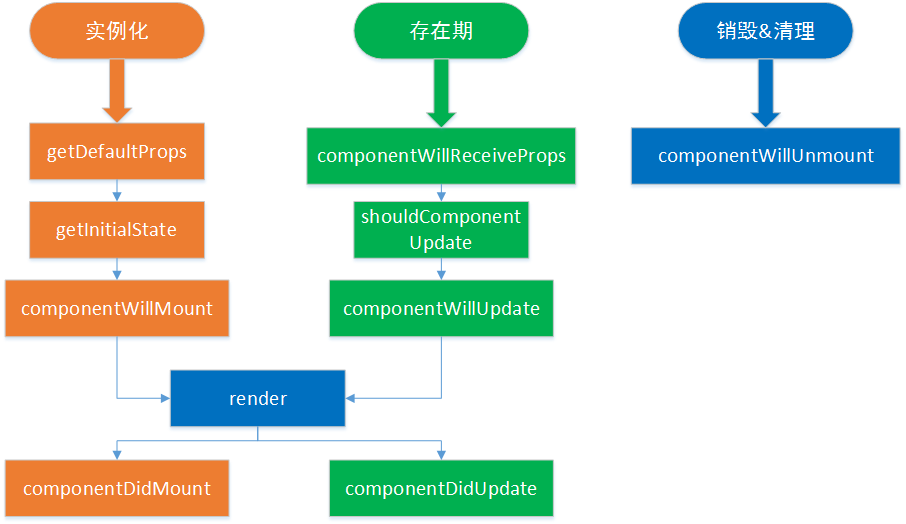

# React
some React Demo &practise

## React lifecycle


## 怎样构建一个React程序
1. 先画出web的草图
2. 将图划分为不同的组件
3. 实现静态版本的程序和组件
4. 将静态版本组合起来
5. 考虑state的组成和实现
6. 添加交互方法
7. 将这些组合在一起，完成最终的版本

## Redux
redux只是将state提升到最外面由redux来管理。整个应用的状态信息都保存在一个store 中，React程序需要由store将数据从组件树的根节点传入到各个组件中。组件不再使用this.state来获取state，而是由this.props 来获取state，所有的点击事件也提到了外部由action来控制。所以这部分视图变得可测试。
整个app的store由

### 步骤
1. actions 创建action
2. reducers
3. 加入到现有程序

#### actions
主要页面上有多少个点击事件，数清楚后，为每一个事件注册个type，为每个事件写函数。每个函数返回一个函数对象，形如

```javascript
export function fetchEntryList() {
  return (dispatch) => {
    storage.getAll()
      .then(items => dispatch(updateEntryList(items)));
  };
}
```
函数对象以（dispatch）为参数，处理完action的动作之后，最后需要调用dispatch这个方法，这个方法需要返回一个对象，包括action的type和store中的state，如上述的`updateEntryList`
```
function updateEntryList(items) {
  return { type: UPDATE_ENTRY_LIST, items };
}
```
action返回action type 和state。reducer根据action type，派发state给组件

#### reducers
对于不同的部分一般分为多个reducer，然后在主reducer中调用redux中的`combineReducers`来结合多个。这里主要是根据不停的事件type返回相应的store。
不同的reducer，首先确定需要哪些state，初始化一些state。整个reducer主要做的就是根据action 返回的 action type 来返回一个state对象。如下所示
```javascript
export default function eidtor(state = initialState, action) {
  switch (action.type) {
    case ActionTypes.SELECT_ENTRY:
      return Object.assign({}, state, { selectedId: action.id });
    case ActionTypes.UPDATE_SAVED_ENTRY:
      return Object.assign({}, state, { selectedId: action.id, isEditing: false });
    case ActionTypes.CREATE_NEW_ENTRY:
      return Object.assign({}, state, { selectedId: null, isEditing: true });
    case ActionTypes.EDIT_ENTRY:
      return Object.assign({}, state, { selectedId: action.id, isEditing: true });
    case ActionTypes.CANCEL_EDIT:
      return Object.assign({}, state, { isEditing: false });
    default:
      return state;
  }
}
```


####  加入到现有程序
redux和react可以加入到现有已经存在的web应用或者react项目中去。需要将上述的action 和 reducer加入dom中去。


##### applyMiddleware
不难理解，在redux里，middleware是发送action和action到达reducer之间的第三方扩展，也就是中间层。也可以这样说，middleware是架在action和store之间的一座桥梁。
在redux里，action仅仅是携带了数据的普通js对象（ plain JavaScript objects）。action creator返回的值是这个action类型的**对象**。然后通过store.dispatch()进行分发.整个流程是这样的
action ---> dispatcher ---> reducers
如果action返回一个函数则会出错，使用redux-thunk,在action到dispatch中间使用中间件，让函数执行完毕后，再传给dispatch，这样action就可以返回一个函数了。如下所示
```javascript
const store = applyMiddleware(thunkMiddleware)(createStore)(rootReducer);
```
##### connect
`connect([mapStateToProps], [mapDispatchToProps], [mergeProps], [options])`
连接操作不会改变原来的组件类，反而返回一个新的已与 Redux store 连接的组件类。

1. `[mapStateToProps]`任何时候，只要 Redux store 发生改变，mapStateToProps 函数就会被调用.该回调函数必须返回一个纯对象，这个对象会与组件的 props 合并。如果你省略了这个参数，你的组件将不会监听 Redux store。
2. `mapDispatchToProps`如果传递的是一个函数，该函数将接收一个 dispatch 函数，然后由你来决定如何返回一个对象，这个对象通过 dispatch 函数与 action creator 以某种方式绑定在一起（提示：你也许会用到 Redux 的辅助函数` bindActionCreators()`）

```javascript
const App = connect(state => ({ state }),
  dispatch => ({
    actions: bindActionCreators(actionCreators, dispatch)
  })
)(Deskmark);
```
上述的操作其实是在Deskmark组件上添加了一层组件，将所有的东西抽离到了上层组件中去了

